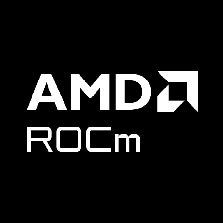

  
  <h3 align="center">
    AI frameworks, inference, and training on AMD GPUs
  </h3>
  

    <a href="https://rocm.docs.amd.com/en/latest/">
      <b>ROCm Core SDK</b>
    </a>
     • 
    <a href="https://rocm.docs.amd.com/projects/ai-ecosystem/en/latest/">
      <b>AI Ecosystem</b>
    </a>
     • 
    <a href="https://instinct.docs.amd.com/latest/">
      <b>GPU Systems and Infrastructure</b>
    </a>
     • 
    <a href="https://rocm.blogs.amd.com/">
      <b>Blogs</b>
    </a>
  

# AMD ROCm™ AI Ecosystem

This repository contains the documentation source for the [ROCm AI
ecosystem](https://rocm.docs.amd.com/projects/ai-ecosystem/en/latest/): guides
covering framework installation and setup, large-scale model training, LLM and
diffusion inference serving, and AI workload performance optimization on AMD
GPUs. The ROCm AI ecosystem lives on top of the [ROCm Core
SDK](https://rocm.docs.amd.com/en/latest/), which provides the underlying GPU
runtimes (HIP), compilers, and math libraries for ROCm-accelerated workloads.

>[!IMPORTANT]
>To learn about supported AMD GPUs and operating systems, see the latest [ROCm
>Core SDK release notes](https://rocm.docs.amd.com/en/latest/about/release-notes.html)
>or the [compatibility matrix](https://rocm.docs.amd.com/en/latest/compatibility/compatibility-matrix.html).
